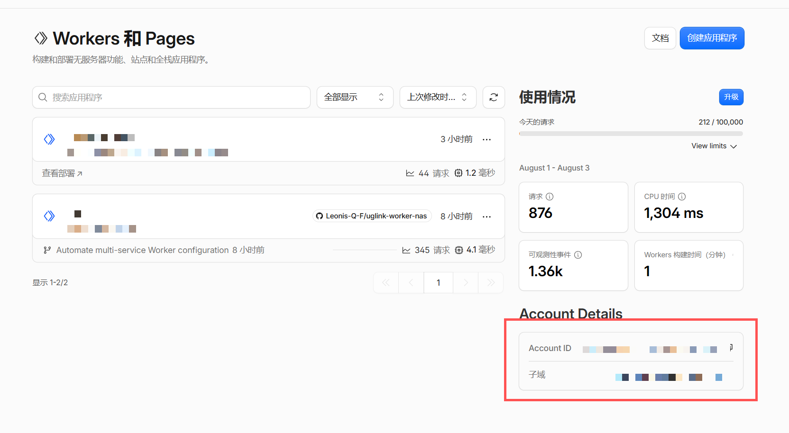
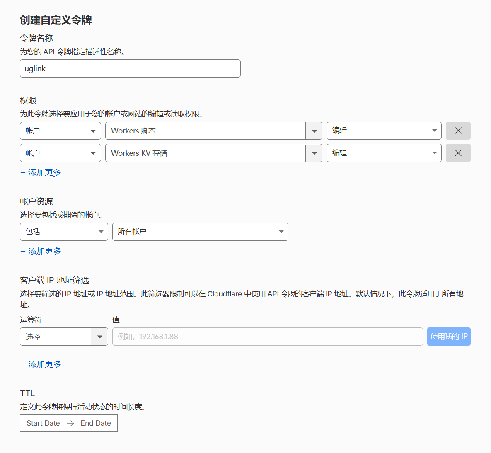

<p align="center">
  
  <br />
  <strong style="font-size: 1.5em;">UGLINK Worker NAS</strong>
</p>

<div align="center">

[](LICENSE)
[](https://github.com/Leonis-Q-F/uglink-worker-nas/pkgs/container/uglink-worker-nas)
[](https://nodejs.org)
[](https://workers.cloudflare.com)

</div>

<div align="center">
  <h3>
    <a href="#快速开始">快速开始</a>
    <span> · </span>
    <a href="#docker-部署推荐">Docker 部署</a>
    <span> · </span>
    <a href="#配置说明">配置说明</a>
    <span> · </span>
    <a href="SECURITY.md">安全策略</a>
  </h3>
</div>

<br />

## 为什么做这个项目？

绿联 NAS 的远程访问功能 (UGLINK) 体验不够理想：依赖官方中转服务器、速度受限、不支持自定义域名。而大多数家庭宽带没有公网 IP，传统的 DDNS + 端口转发方案也难以适用。

我们希望有一种方式，**不需要公网 IP、不需要复杂的网络配置**，就能通过自己的域名稳定地访问 NAS 上运行的各种服务。

UGLINK Worker NAS 的做法是：利用绿联已有的远程访问通道获取代理凭证，再通过 Cloudflare Workers 把流量转发到 NAS —— 相当于把 Cloudflare 的全球边缘网络变成了你的 NAS 入口。

**它的特点：**

- **零门槛** — Cloudflare 免费计划就够用，不需要公网 IP
- **可视化操作** — 一个 Web 控制台搞定所有配置和部署，不需要碰命令行
- **安全** — 密码和 Token 加密存储在服务端，不会出现在浏览器
- **云端恢复** — 连接已有 UGLINK Worker 时，检测并确认导入 Cloudflare KV 中的已发布配置
- **自托管** — 数据完全在你自己手里，Docker 一行命令启动
- **开源** — MIT 协议，随意使用和修改

## 工作原理

```
                   你的浏览器
                       │
                       ▼
           ┌───────────────────────┐
           │   Cloudflare Workers  │  ← 全球边缘网络
           │   (Gateway Worker)    │
           └───────────┬───────────┘
                       │  UGLINK 远程代理通道
                       ▼
           ┌───────────────────────┐
           │     绿联 NAS          │  ← 你的本地服务
           │  (管理面板/文件/媒体)    │
           └───────────────────────┘
```

项目包含两个组件：

| 组件 | 部署位置 | 说明 |
|------|---------|------|
| **Console 管理控制台** | 本地 Docker 或 Cloudflare | Web UI，配置连接信息、管理服务映射、一键部署 |
| **Gateway Worker** | Cloudflare | 反向代理，接收请求后通过 UGLINK 通道转发到 NAS |

## 快速开始

### 前置条件

- 一台绿联 NAS，已启用远程访问（UGLINK）
- 一个 [Cloudflare 账户](https://dash.cloudflare.com/sign-up)（免费计划即可）
- Docker 和 Docker Compose（用于本地部署管理控制台）

### 获取 Cloudflare Account ID

登录 [Cloudflare Dashboard](https://dash.cloudflare.com)，进入 **Workers & Pages** 页面，在右侧即可找到你的 Account ID：

<p align="center">
  
</p>

### 创建 API Token

前往 [API Tokens](https://dash.cloudflare.com/profile/api-tokens) 页面创建一个自定义 Token，所需权限如下：

<p align="center">
  
</p>

> [!WARNING]
> **不要使用 Global API Key。** 只需要授予以下最小权限，并把范围限制到目标账户：
>
> | 权限 | 级别 |
> |------|------|
> | Account / Workers Scripts | Edit |
> | Account / Workers KV Storage | Edit |

---

### Docker 部署（推荐）

适合在绿联 NAS 或任何 Docker 环境上运行。

```bash
# 1. 创建项目目录
mkdir uglink && cd uglink

# 2. 下载 compose 配置
cat > compose.yaml << 'EOF'
name: uglink

services:
  console:
    image: ghcr.io/leonis-q-f/uglink-worker-nas:latest
    init: true
    restart: unless-stopped
    ports:
      - "5173:8787"
    volumes:
      - uglink-data:/data
    read_only: true
    tmpfs:
      - /tmp:size=64m,mode=1777
    cap_drop:
      - ALL
    security_opt:
      - no-new-privileges:true

volumes:
  uglink-data:
    name: uglink-data
EOF

# 3. 启动
docker compose up -d
```

打开 `http://设备地址:5173`，按照界面引导完成配置即可。控制台数据保存在 Docker 管理的 `uglink-data` 卷中，删除或更新容器不会清除配置，也不需要手动调整宿主机目录权限。

> [!TIP]
> 镜像支持 `linux/amd64` 和 `linux/arm64` 架构，可直接在绿联 NAS 的 Docker 中运行。

### 从源码部署

```bash
git clone https://github.com/Leonis-Q-F/uglink-worker-nas.git
cd uglink-worker-nas
npm ci
npm run deploy:console
```

> 需要先通过 `wrangler login` 登录 Cloudflare。

## 配置说明

### uglink.config.json

Gateway Worker 的核心配置，由控制台自动生成：

```jsonc
{
  "version": 2,
  "uglink": {
    "id": "your-uglink-id",
    "username": "your-nas-login-username"
  },
  "services": [
    {
      "name": "nas-admin",
      "hostname": "nas.example.com",
      "port": 8443,
      "enabled": true
    }
  ]
}
```
### 环境变量

| 变量 | 说明 | 默认值 |
|------|------|--------|
| `UGLINK_BIND_ADDRESS` | 绑定地址 | `0.0.0.0` |
| `UGLINK_CONSOLE_PORT` | 控制台端口 | `5173` |
| `UGLINK_IMAGE` | Docker 镜像 | `ghcr.io/leonis-q-f/uglink-worker-nas:latest` |
| `SESSION_ENCRYPTION_KEY` | 会话加密密钥（可选，自动生成） | 自动生成 |

### 数据持久化与备份

- `uglink-data` 卷保存自动生成的会话加密密钥、本地 KV、加密 API Token、服务配置与诊断记录。
- 已发布的非秘密配置同步到目标 Worker 的 `UGLINK_CACHE` KV；API Token、NAS 密码和本地草稿不会同步。
- 更新时使用 `docker compose pull && docker compose up -d`；不要执行 `docker compose down --volumes` 或手动删除 `uglink-data`。
- 加密备份包含 Cloudflare 连接、UGREENlink ID、NAS 登录用户名、服务配置和诊断记录，需要至少 12 个字符的独立备份密码。
- NAS 登录密码由 Cloudflare Worker Secret 保存，Cloudflare 不允许读取 Secret 明文，因此不会进入备份文件。
- 完整灾难恢复应停止控制台后成组备份整个卷；卷备份和应用导出的加密备份都应按敏感数据保管。

完整卷备份示例：

```bash
mkdir -p backup
docker compose stop console
docker run --rm -v uglink-data:/data:ro -v "$PWD/backup:/backup" alpine \
  tar czf /backup/uglink-data.tgz -C /data .
docker compose start console
```

如需直接管理宿主机文件，可以把卷改为 `/volume1/docker/uglink:/data` 等绝对路径；该高级方案需要提前为容器内 UID/GID `1000:1000` 配置写入权限。

## 本地开发

```bash
npm ci             # 安装依赖
npm run dev        # 启动控制台开发服务器
npm run dev:gateway    # 启动 Gateway Worker 开发模式
npm test           # 运行测试
npm run typecheck  # 类型检查
npm run check      # 完整检查（审计 + 测试 + 类型 + 构建）
```

## 项目架构

```
src/
├── domain/            # 领域层 — 核心业务模型与规则
│   ├── configuration/     # 配置校验
│   ├── deployment/        # 部署流程模型
│   └── proxy/             # 代理路由
├── application/       # 应用层 — 用例编排
│   ├── console/           # 控制台（连接、部署）
│   └── gateway/           # 网关请求处理
├── infrastructure/    # 基础设施层 — 外部服务适配
│   ├── cloudflare/        # Cloudflare API
│   ├── persistence/       # KV 存储
│   ├── security/          # 会话加密
│   └── ugreen/            # 绿联代理通信
└── interfaces/        # 接口层
    ├── http/              # Worker 入口（Console / Gateway）
    └── web/               # React 前端控制台
```

**技术栈：** TypeScript · React 19 · Vite · Cloudflare Workers · Cloudflare KV · Wrangler · Docker

## 安全

> [!IMPORTANT]
> 通过 Custom Domain 暴露 NAS 服务到公网存在风险。请务必阅读 [SECURITY.md](SECURITY.md)。

- 绿联密码仅存储在 Worker Secret，API Token 加密存储在服务端会话
- Docker 默认监听所有本机网络接口；请仅在可信局域网使用，远程访问时必须配置 HTTPS 和访问控制
- 不要使用 Global API Key，不要把密码提交到 Git
- 远程访问控制台请配合反向代理 + HTTPS 或 [Cloudflare Access](https://www.cloudflare.com/products/zero-trust/access/)

## 贡献

欢迎提交 Issue 和 Pull Request！

```bash
# 提交前请通过完整检查
npm run check
```

## 许可协议

[MIT](LICENSE)
