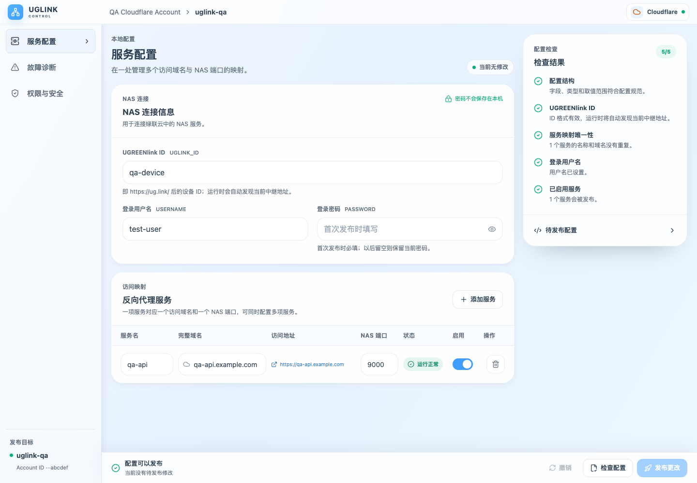
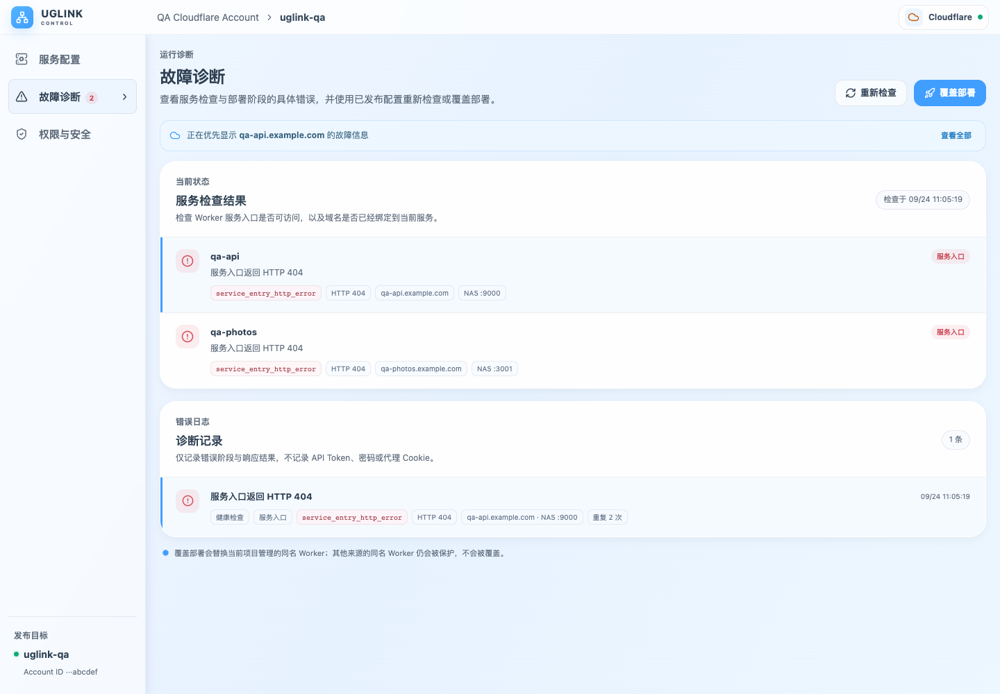
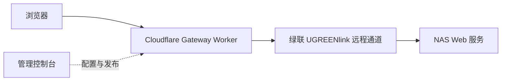

<div align="center">
  <h1>UGLINK Worker NAS</h1>
  <p><strong>用自己的域名，访问绿联 NAS 上的 Web 服务。</strong></p>
  <p>基于 Cloudflare Workers 与 UGREENlink 的远程访问网关，配有可自托管的管理控制台。</p>
  <p>
    <a href="https://github.com/Leonis-Q-F/uglink-worker-nas/actions/workflows/check.yml"></a>
    <a href="https://github.com/Leonis-Q-F/uglink-worker-nas/releases/latest"></a>
    
    <a href="LICENSE"></a>
  </p>
  <p>
    <a href="#快速开始">快速开始</a> ·
    <a href="docs/deployment.md">使用指南</a> ·
    <a href="https://github.com/Leonis-Q-F/uglink-worker-nas/releases">更新记录</a> ·
    <a href="CONTRIBUTING.md">参与贡献</a>
  </p>
</div>

## 它能做什么

为绿联 NAS 上不同端口的 Web 服务分配独立子域名，通过一个控制台管理配置并发布到 Cloudflare。家庭宽带无需公网 IP，也无需在路由器上配置入站端口转发。

例如，将笔记服务映射到 `notes.example.com`，将另一个 Web 应用映射到 `app.example.com`。访问者使用域名，Gateway 根据配置转发到对应的 NAS 端口。

项目沿用绿联 UGREENlink 远程通道，提供域名入口和管理能力；不会绕过官方中继，也不保证提高传输速度。

| 能力 | 你可以做什么 |
| --- | --- |
| 服务映射 | 为每项 Web 服务配置独立域名与 NAS 端口，启用或停用映射 |
| 配置与发布 | 保存草稿，在控制台发布 Gateway 和自定义域名，按配置差异同步服务 |
| 状态与诊断 | 检查 Worker 入口、域名识别情况，查看错误阶段与诊断记录 |
| 云端配置恢复 | 连接已有 Gateway 时，检测并确认导入已发布配置 |
| 加密备份 | 导出和恢复 Cloudflare 连接、服务配置与诊断记录 |

## 控制台预览

NAS 连接、服务映射和配置检查集中在一个页面：

<p align="center">
  
</p>

<details>
  <summary>查看故障诊断界面</summary>
  <p>按服务查看入口状态、错误码和诊断记录。</p>
  
</details>

截图来自实际控制台，使用模拟账户与服务数据，不代表真实 NAS 的连通性。

## 快速开始

### 准备工作

- 一台已启用 UGREENlink 远程访问的绿联 NAS，以及 NAS 本地登录账号。
- Cloudflare 账户和一个已托管到 Cloudflare 的自有域名，每个服务使用独立子域名。
- 限定到目标账户、具有 `Workers Scripts: Edit` 和 `Workers KV Storage: Edit` 权限的 API Token。
- Docker 和 Docker Compose，用于运行管理控制台。

Account ID 和 Token 的获取方法见 [账户与权限配置](docs/deployment.md#cloudflare-账户与权限)。

### 启动控制台

在空目录下载配置并启动发布镜像：

```bash
mkdir uglink
cd uglink
curl -fL https://raw.githubusercontent.com/Leonis-Q-F/uglink-worker-nas/main/compose.yaml -o compose.yaml
docker compose up -d --no-build
```

打开 `http://设备地址:5173`，依次完成：

1. 连接 Cloudflare 账户，选择目标 Worker 名称。
2. 填写 UGREENlink ID、NAS 本地登录用户名和密码。
3. 添加服务域名与 NAS 端口，检查配置并发布。

[Docker 镜像](https://github.com/Leonis-Q-F/uglink-worker-nas/pkgs/container/uglink-worker-nas)支持 `linux/amd64` 和 `linux/arm64`。配置保存在 `uglink-data` 卷中，重建容器不会删除该卷。

> [!IMPORTANT]
> 控制台默认监听所有网络接口，仅供可信局域网使用。远程访问应配置身份验证和 HTTPS。映射到公网的 NAS 应用也应保留自身认证，敏感服务建议配置 Cloudflare Access。

不希望在本地运行 Docker，也可以 [将控制台部署到 Cloudflare](docs/deployment.md#将管理控制台部署到-cloudflare)。

## 如何运行



| 组件 | 运行位置 | 职责 |
| --- | --- | --- |
| 管理控制台 | 本地 Docker 或 Cloudflare | 配置、发布、备份与诊断 |
| Gateway Worker | Cloudflare | 获取绿联代理会话，按域名转发请求 |

本地控制台不承载 NAS 访问流量。发布完成后，Gateway 在 Cloudflare 上独立运行。

## 使用边界与数据安全

- **协议与兼容性**：面向 HTTP/HTTPS Web 服务，不是通用 TCP/UDP 隧道。依赖绿联远程接口及登录流程，固件或上游接口变化可能影响兼容性。
- **文件与实时连接**：大文件上传、长时间下载、WebSocket 和媒体播放需要按目标应用实测，目前没有覆盖所有应用和固件的兼容性保证。
- **平台配额**：可使用 Cloudflare 免费计划部署，但请求、计算和 KV 等资源受 [平台配额](https://developers.cloudflare.com/workers/platform/limits/)限制。
- **检查范围**：Worker 入口正常，只表示入口可访问且域名已被识别，不代表 NAS 登录或后端应用一定正常。

API Token 和 NAS 密码由用户在浏览器输入并提交，不持久化到浏览器存储。API Token 加密保存在控制台服务端会话中，NAS 密码保存在 Gateway 的 Worker Secret 中。

访问流量经过 Cloudflare 和绿联服务；配置及代理会话使用各自的 KV 存储。加密备份包含 Cloudflare 连接等敏感信息，但不包含无法回读的 NAS 密码。详细边界见 [安全策略](SECURITY.md)。

## 更新与备份

更新前查看 [Release 说明](https://github.com/Leonis-Q-F/uglink-worker-nas/releases)，然后执行：

```bash
docker compose pull
docker compose up -d --no-build
```

更新控制台不会自动更新已发布的 Gateway。涉及网关变更时，在更新后的控制台进入「故障诊断 → 覆盖部署」，即可使用已发布配置更新网关。

请保留 `uglink-data` 卷；迁移和恢复前先做好备份。操作步骤见 [数据持久化与备份](docs/deployment.md#数据持久化与备份)。

## 文档

| 文档 | 内容 |
| --- | --- |
| [部署指南](docs/deployment.md) | Cloudflare 权限、Docker 设置、云端部署、更新与备份 |
| [配置说明](docs/configuration.md) | 控制台配置与本地文件的区别、Gateway 字段及各配置文件用途 |
| [贡献指南](CONTRIBUTING.md) | 开发环境、源码分层、测试和提交约定 |
| [安全策略](SECURITY.md) | 凭证处理、服务暴露边界与漏洞报告方式 |

## 开发与贡献

项目使用 TypeScript、React、Vite、Cloudflare Workers 和 KV。建议使用 Node.js 22.12+ 的 22.x 版本和 npm 10+，完整版本约束见 `package.json`。

```bash
git clone https://github.com/Leonis-Q-F/uglink-worker-nas.git
cd uglink-worker-nas
npm ci
npm run dev
```

开发服务器默认使用 `http://127.0.0.1:5173`。若 Docker 控制台已占用端口，请先停止它或调整端口。通过 Docker 运行当前源码可使用 `npm run docker:up`，该命令会构建本地源码。

```bash
npm test            # Gateway 和 Console 测试
npm run check       # 审计、配置校验、测试、类型检查与构建
npm run qa:browser  # 控制台运行后，执行模拟 API 的浏览器回归
```

浏览器路径等环境设置见 [贡献指南](CONTRIBUTING.md#验证)。PR 和镜像发布均运行完整检查，本地或模拟测试不能替代真实 NAS 验证。

<details>
  <summary>源码结构</summary>

```text
src/
├── domain/          # 核心模型、配置规则与代理路由
├── application/     # 控制台与 Gateway 用例编排
├── infrastructure/  # Cloudflare、绿联、KV 与加密适配
└── interfaces/      # HTTP 入口与 React 界面
test/                # Gateway 与 Console 测试
scripts/             # 配置生成、构建辅助、审计与浏览器回归
docker/              # 容器启动与 Worker 运行配置
docs/                # 部署、配置与备份说明
assets/              # 界面预览与配置说明图片
```

</details>

欢迎提交 [Issue](https://github.com/Leonis-Q-F/uglink-worker-nas/issues) 和 Pull Request。具体故障的排查过程放在对应 Issue，安全问题按 [私密报告方式](SECURITY.md#报告漏洞)处理。

## 许可证与致谢

本项目使用 [MIT 许可证](LICENSE)。感谢 [linux.do](https://linux.do/) 社区的讨论、分享与反馈，以及参与测试和贡献代码的朋友。
