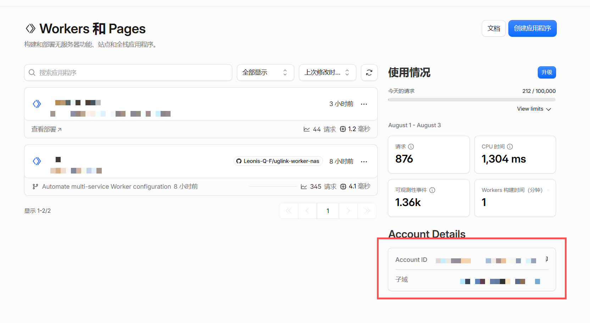
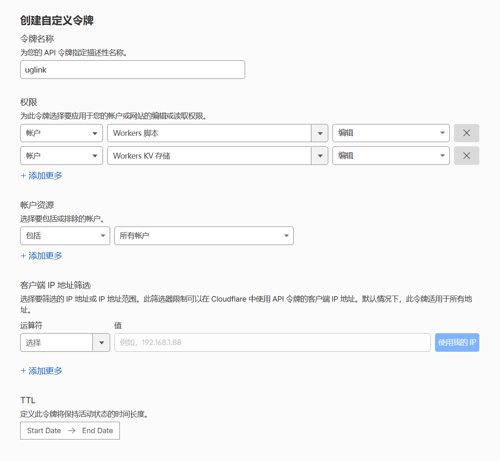
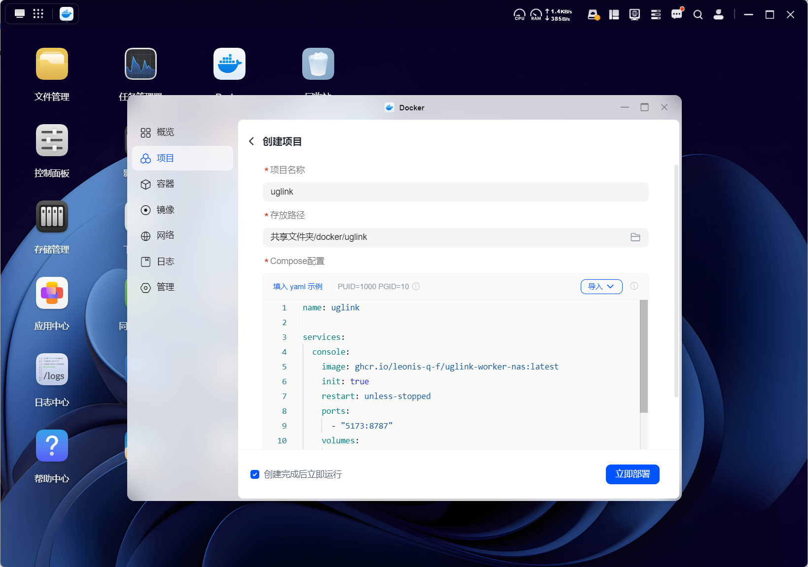
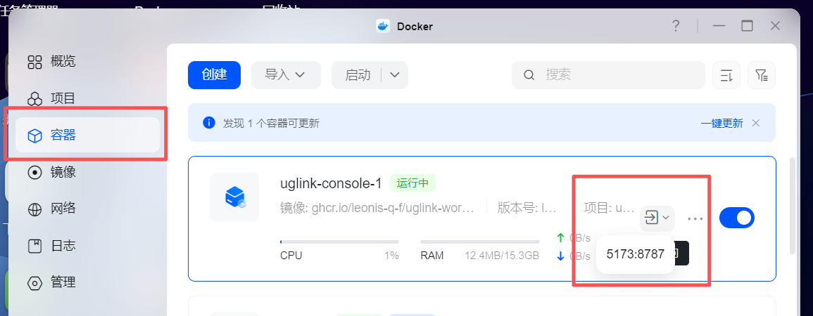
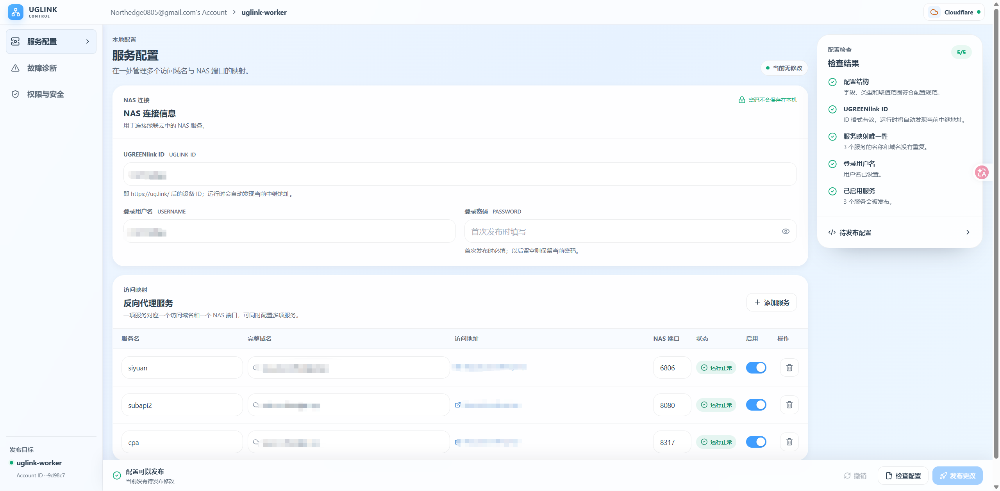

# 部署 UGLINK Worker NAS

管理控制台可以运行在本地 Docker 或 Cloudflare Workers。两种方式都把 Gateway 部署到 Cloudflare，访问 NAS 时无需经过本地控制台。

## Cloudflare 账户与权限

### 获取 Cloudflare Account ID

登录 [Cloudflare Dashboard](https://dash.cloudflare.com)，进入 **Workers & Pages** 页面，在右侧即可找到你的 Account ID：

<p align="center">
  
</p>

### 创建 API Token

前往 [API Tokens](https://dash.cloudflare.com/profile/api-tokens) 页面创建一个自定义 Token，所需权限如下：

<p align="center">
  
</p>

> [!WARNING]
> **不要使用 Global API Key。** 只需要授予以下最小权限，并把范围限制到目标账户：
>
> | 权限                         | 级别 |
> | ---------------------------- | ---- |
> | Account / Workers Scripts    | Edit |
> | Account / Workers KV Storage | Edit |
>

## 在绿联云 NAS 的 Docker 应用中部署

在绿联云 NAS 的应用中心安装并打开 **Docker** 应用。以下步骤都在图形界面中完成，无需 SSH 或命令行。

### 1. 创建项目并填写 YAML

进入 Docker 的「项目」页面，创建项目：

- **项目名称**：填写 `uglink`。
- **存放路径**：选择用于保存项目文件的文件夹，例如 `共享文件夹/docker/uglink`。
- **Compose 配置**：将下面的 YAML 完整粘贴到编辑框中。

```yaml
name: uglink

services:
  console:
    image: ghcr.io/leonis-q-f/uglink-worker-nas:latest
    init: true
    restart: unless-stopped
    ports:
      - "5173:8787"
    volumes:
      - uglink-data:/data
    read_only: true
    tmpfs:
      - /tmp:size=64m,mode=1777
    cap_drop:
      - ALL
    security_opt:
      - no-new-privileges:true
    stop_grace_period: 20s

volumes:
  uglink-data:
    name: uglink-data
```

如果 NAS 的 `5173` 端口已被占用，将 `"5173:8787"` 改为例如 `"5180:8787"`，右侧容器端口 `8787` 保持不变。此配置直接使用发布镜像，不需要下载源码或额外创建 `.env` 文件。

勾选「创建完成后立即运行」，点击「立即部署」。

<p align="center">
  
</p>

### 2. 等待部署并确认容器运行

等待镜像下载和项目创建完成。部署日志会显示网络、数据卷和容器的创建结果，点击「完成」返回。

<p align="center">
  
</p>

进入「容器」页面，找到 `uglink-console-1`，确认状态为「运行中」。通过容器右侧的访问入口选择 `5173:8787`，或在浏览器中打开 `http://你的NAS局域网IP:5173`。如果前面修改了主机端口，这里也使用修改后的端口。

<p align="center">
  
</p>

日志中的 `Created` 只表示资源已创建。如果容器反复重启或网页无法打开，请查看容器日志，确认是否出现启动错误。

### 3. 连接 Cloudflare 并按需导入配置

打开控制台后，填写前面准备好的 **Cloudflare Account ID** 和 **API Token**，选择目标 Worker 名称并连接。

如果该 Worker 已保存本项目的已发布配置，控制台会提示「检测到已有配置」。需要恢复时点击「导入配置」；首次使用时没有该提示，直接继续配置即可。

<p align="center">
  
</p>

导入会替换当前控制台的已发布配置和本地草稿。API Token 和 NAS 密码不会从云端配置读取。

### 4. 填写 NAS 信息并发布服务

在「服务配置」页面完成以下设置：

1. 填写 **UGREENlink ID**，即 `https://ug.link/` 后的设备 ID，并确保 NAS 已启用 UGREENlink 远程访问。
2. 填写 **NAS 本地登录用户名和密码**。首次发布必须填写密码，后续发布留空则保留已部署的密码。
3. 点击「添加服务」，填写服务名称、完整域名和 NAS 端口，并启用服务。每项服务使用独立子域名，所属域名需已托管到当前 Cloudflare 账户。
4. 点击「检查配置」，确认后点击「发布更改」，等待发布完成，再通过服务域名访问对应应用。

<p align="center">
  
</p>

控制台配置和自动生成的会话加密密钥保存在 Docker 的 `uglink-data` 数据卷中，并非项目存放路径下的普通文件。重建或更新容器时保留该卷；已有同名卷会被复用。配置检查通过不代表 NAS 后端应用一定可达，发布后仍需实际访问验证。

### Compose 配置

上面的图形界面教程已将镜像和端口直接写入 YAML，需要调整时编辑对应字段即可。以下变量适用于使用仓库原始 [compose.yaml](../compose.yaml) 的部署方式。

下列变量写入 Compose 项目目录的 `.env`。完整示例见 [`.env.example`](../.env.example)。

| 变量                    | 说明                                      | 默认值                                          |
| ----------------------- | ----------------------------------------- | ----------------------------------------------- |
| `UGLINK_BIND_ADDRESS` | 主机监听地址；仅本机使用时填`127.0.0.1` | `0.0.0.0`                                     |
| `UGLINK_CONSOLE_PORT` | 主机端口                                  | `5173`                                        |
| `UGLINK_IMAGE`        | 镜像地址及版本                            | `ghcr.io/leonis-q-f/uglink-worker-nas:latest` |

### 会话加密密钥

Docker 首次启动自动生成会话加密密钥并保存在数据卷中，通常无需手动设置。

如果必须提供自己的密钥，先用下面的命令生成 32 字节 base64url 密钥，保存在密码管理器中：

```bash
node -e "console.log(require('node:crypto').randomBytes(32).toString('base64url'))"
```

在 `.env` 中添加 `SESSION_ENCRYPTION_KEY`，并在现有 `compose.yaml` 的 `services.console` 下添加以下配置，其他字段保持原样：

```yaml
environment:
  SESSION_ENCRYPTION_KEY: "${SESSION_ENCRYPTION_KEY:?Set SESSION_ENCRYPTION_KEY in .env}"
```

仅在 `.env` 中设置变量不会自动传入容器。密钥变更后，旧的加密会话将无法读取；迁移时应保留原密钥。

### 更新

在绿联云 NAS 的 **Docker → 容器** 页面中更新，无需命令行：

1. 更新前查看 [Release 说明](https://github.com/Leonis-Q-F/uglink-worker-nas/releases)，并备份控制台配置。
2. 找到 `uglink-console-1`。检测到新镜像时，容器名称旁会显示「可更新」标记，如下图所示。
3. 点击该容器的「可更新」入口，按界面提示完成更新，保留原有的 `uglink-data` 数据卷。
4. 等待容器恢复「运行中」，重新打开控制台，确认原有配置正常。

<p align="center">
  
</p>

前面的 YAML 使用 `latest` 镜像标签。需要固定版本时，在项目的 Compose 配置中，将 `image` 末尾的 `latest` 改为所需的已发布版本标签。更新过程中不要删除数据卷，控制台配置和会话加密密钥都保存在其中。

更新控制台不会自动更新已经部署的 Gateway。涉及网关变更时，请按照 [Release 说明](https://github.com/Leonis-Q-F/uglink-worker-nas/releases)，在更新后的控制台进入「故障诊断 → 覆盖部署」。该操作使用已发布配置更新项目管理的同名 Worker，保留现有 NAS 密码，无需修改服务配置来启用发布按钮。

## 将管理控制台部署到 Cloudflare

此方式不需要 Docker。建议使用 Node.js 22.13+ 的 22.x 版本和 npm 10+。

```bash
git clone https://github.com/Leonis-Q-F/uglink-worker-nas.git
cd uglink-worker-nas
npm ci
npx wrangler login
npx wrangler kv namespace create CONSOLE_SESSIONS --config wrangler.jsonc
```

将创建结果中的命名空间 ID 填入 `wrangler.jsonc` 的 `kv_namespaces`，替换 `CONSOLE_SESSIONS` 对应的全零占位 ID。按需修改 `name`；后续密钥配置和部署必须使用同一个 Worker 名称。

然后配置控制台会话密钥。以下命令直接通过标准输入提交新密钥，不把密钥写入仓库：

```bash
npm run --silent secret:key | npx wrangler secret put SESSION_ENCRYPTION_KEY --config wrangler.jsonc
```

如果 Wrangler 提示目标 Worker 尚不存在，确认创建。已有部署迁移时应使用原密钥，不要随意重新生成。

```bash
npm run deploy:console
```

部署成功后通过 Wrangler 输出的地址打开控制台，并在控制台连接目标 Cloudflare 账户。Wrangler 的登录用于部署控制台，不替代控制台内的 API Token 连接。

云端控制台应配置访问控制。`.dev.vars` 只用于本地开发，不会替代生产环境的 Worker Secret。

返回 [项目首页](../README.md)。
